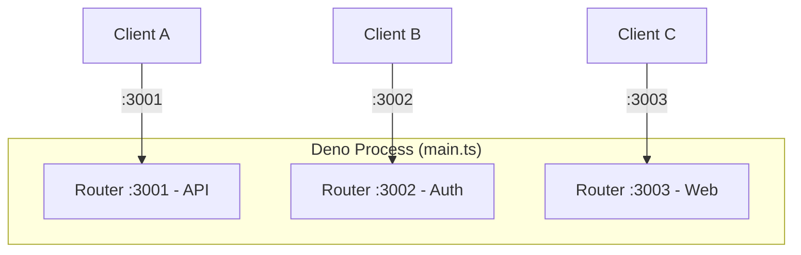
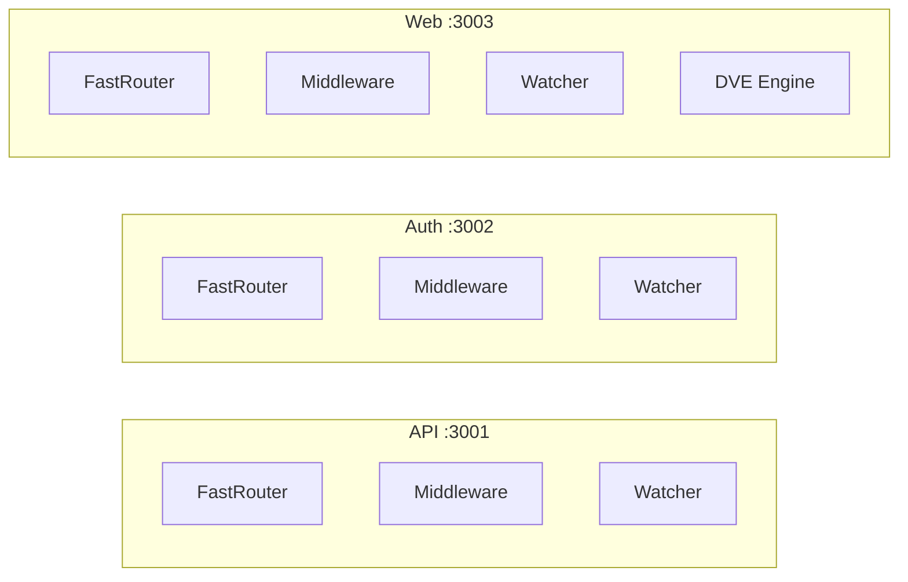
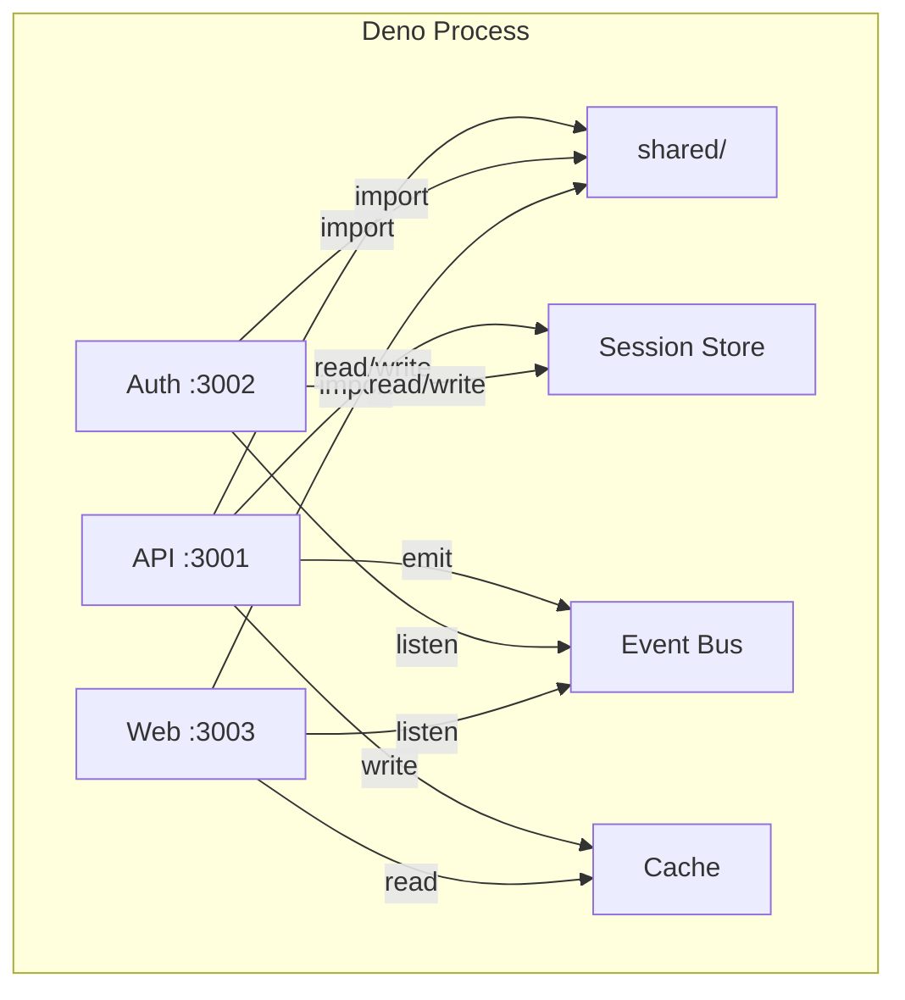
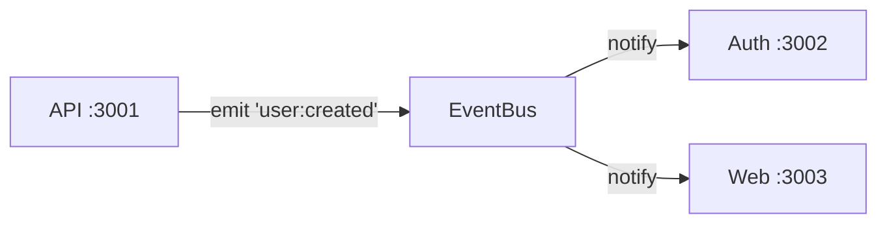
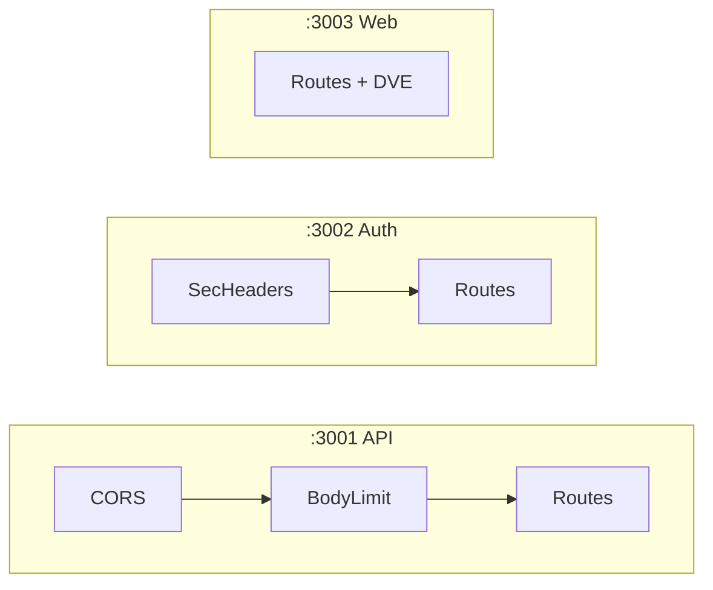
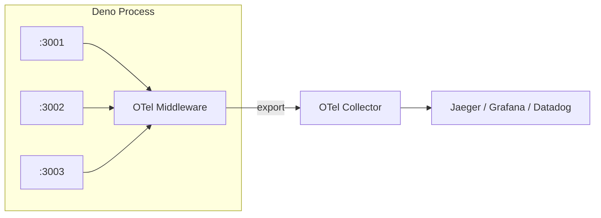
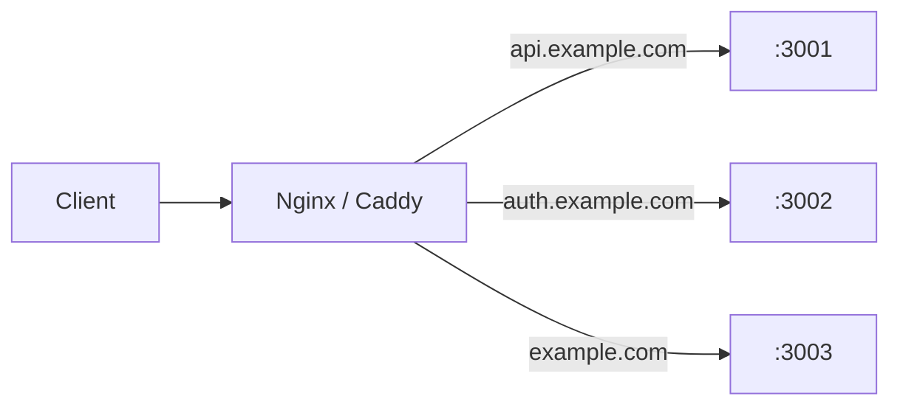
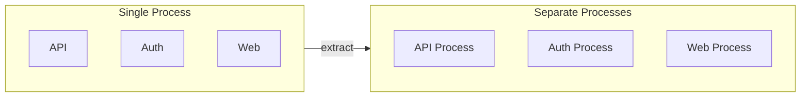

# Multi-Service

Deserve runs multiple servers from a single Deno process. Each `Router` is a standalone server with its own routes, middleware, file watcher, and port. They are isolated at the request level, so a fault in one never bleeds into another, yet they share the same process memory, which lets them share code, state, and infrastructure without any network overhead.

Traditionally, running 5 services means 5 processes, 5 deployments, and 5 copies of the shared code. With Deserve, one `main.ts` spawns as many routers as memory can hold, and each one listens on its own port and watches its own directory while a fault in one is contained instead of taking down the rest.



## Basic Setup

One `Router` per service, one port per router, one `Promise.all` to start them all:

```typescript twoslash
import { Router } from '@neabyte/deserve'

// One Router per service
const api = new Router({ routesDir: './services/api/routes' })
const auth = new Router({ routesDir: './services/auth/routes' })
const web = new Router({
  routesDir: './services/web/routes',
  viewsDir: './services/web/views'
})

// Run every service together
await Promise.all([
  api.serve(3001),
  auth.serve(3002),
  web.serve(3003)
])
```

That is the entire entry point.

## Router Isolation

Every `Router` runs in request-level isolation. Each one owns its own radix-tree router, middleware stack, Superwatcher instance, and optional template engine. They do not share any internal state unless it is explicitly wired up, while the process underneath is still shared, which is what makes the [shared code and state](#sharing-code-and-state) below possible.

Faults are contained at two levels. A throw inside one handler becomes an error response for that one request, so the rest of that service and every other service keep serving. A deeper fault that escapes a handler, like an unhandled rejection or an attempt to exit the process, is trapped process-wide by [process protection](/getting-started/server-configuration#process-protection) and surfaced as an event rather than a shutdown, so no service goes down.



If a route in API throws, only that request gets a 500. Auth and Web, and every other API request, keep serving normally.

## Directory Structure

Every service follows the same folder convention. A new team member sees this layout and immediately knows where routes, views, and shared code live. No guessing, no project-specific conventions to learn.

```
project/
├── main.ts
├── shared/
│   ├── utils.ts
│   ├── sessions.ts
│   ├── bus.ts
│   ├── cache.ts
│   ├── logger.ts
│   └── errors.ts
└── services/
    ├── api/
    │   └── routes/
    │       ├── health.ts          # GET  :3001/health
    │       ├── me.ts              # GET  :3001/me
    │       └── users/
    │           ├── index.ts       # GET  :3001/users
    │           └── [id].ts        # GET  :3001/users/:id
    ├── auth/
    │   └── routes/
    │       ├── login.ts           # POST :3002/login
    │       ├── logout.ts          # POST :3002/logout
    │       └── verify.ts          # GET  :3002/verify
    └── web/
        ├── routes/
        │   └── index.ts           # GET  :3003/
        └── views/
            └── home.dve
```

- Routes go in `services/<name>/routes/`
- Shared code goes in `shared/`
- `main.ts` wires everything together

## Sharing Code and State

Sharing one process is where the multi-service model pays off. Instead of Redis, HTTP calls, or a message broker, the services share state through plain objects in memory at the speed of a function call.



### Shared Modules

Utility functions, database connections, configuration, validation schemas - write once in `shared/`, import from any service:

```typescript twoslash
// shared/utils.ts
// Shared helpers and constants
export function formatDate(date: Date): string {
  return date.toISOString().split('T')[0]!
}

export const APP_NAME = 'MyApp'
```

```typescript
// services/api/routes/index.ts
// Import shared code, no HTTP hop
import type { Context } from '@neabyte/deserve'
import { APP_NAME } from '../../../shared/utils.ts'

// Use the shared constant here
export function GET(ctx: Context): Response {
  return ctx.send.json({
    app: APP_NAME,
    service: 'api'
  })
}
```

### Session Store

A single `Map` serves as a session store for all services. Auth writes sessions on login, API reads them to authenticate requests. No Redis, no HTTP call between services:

```typescript twoslash
// shared/sessions.ts
// In-memory store shared by services
export const sessions = new Map<string, Record<string, unknown>>()
```

```typescript
// services/auth/routes/login.ts
import type { Context } from '@neabyte/deserve'
import { sessions } from '../../../shared/sessions.ts'

// Auth saves the session on login
export async function POST(ctx: Context): Promise<Response> {
  const body = (await ctx.json()) as { username?: string }
  const id = crypto.randomUUID()
  sessions.set(id, {
    username: body?.username,
    loggedInAt: Date.now()
  })
  return ctx.send.json({ sessionId: id })
}
```

```typescript
// services/api/routes/me.ts
import type { Context } from '@neabyte/deserve'
import { sessions } from '../../../shared/sessions.ts'

// API reads the same store directly
export function GET(ctx: Context): Response {
  const id = ctx.header('x-session-id')
  const session = id ? sessions.get(id) : undefined
  if (!session) {
    return ctx.send.json({ error: 'Not authenticated' }, { status: 401 })
  }
  return ctx.send.json({ user: session })
}
```

### Event Bus

When API creates a user, Auth and Web can know about it instantly, with no message queue and no polling, just a direct function call across services. This bus carries application facts like `user:created`. For framework activity such as requests, routes, and faults, use the built-in [observability events](/middleware/observability/overview) instead.



```typescript twoslash
// shared/bus.ts
// Minimal in-process event bus
type Listener = (...args: unknown[]) => void
const listeners = new Map<string, Set<Listener>>()

export function emit(event: string, ...args: unknown[]): void {
  for (const fn of listeners.get(event) ?? []) {
    fn(...args)
  }
}

export function on(event: string, fn: Listener): void {
  if (!listeners.has(event)) {
    listeners.set(event, new Set())
  }
  listeners.get(event)!.add(fn)
}
```

```typescript
// services/api/routes/users/index.ts
import type { Context } from '@neabyte/deserve'
import { emit } from '../../../../shared/bus.ts'

// Emit an event after creating a user
export async function POST(ctx: Context): Promise<Response> {
  const user = await ctx.json()
  emit('user:created', user)
  return ctx.send.json({ created: true })
}
```

Any service can listen with `on('user:created', ...)` in `main.ts` or inside its own routes.

### Cache

A shared `Map` with TTL eliminates duplicate work. API computes and caches, Web reads the cached result. Zero network cost:

```typescript twoslash
// shared/cache.ts
// Shared cache with expiry per entry
const store = new Map<string, { value: unknown; expires: number }>()

export function get<T>(key: string): T | undefined {
  const entry = store.get(key)
  if (!entry || entry.expires < Date.now()) {
    store.delete(key)
    return undefined
  }
  return entry.value as T
}

export function set(key: string, value: unknown, ttlMs: number): void {
  store.set(key, {
    value,
    expires: Date.now() + ttlMs
  })
}
```

### HTTP Between Services

When one service needs to call another service's HTTP endpoint (not just shared code), use `fetch`. Both services are in the same process, so the call stays on localhost:

```typescript twoslash
// services/web/routes/dashboard.ts
import type { Context } from '@neabyte/deserve'

// Call API service, then render template
export async function GET(ctx: Context): Promise<Response> {
  const users = await fetch('http://localhost:3001/users').then((r) => r.json())
  return await ctx.render('dashboard.dve', { users })
}
```

### The Trade-off

Shared state is a feature, not a free lunch. [Router isolation](#router-isolation) keeps a fault inside one service, yet a shared `Map` is the opposite of isolation by design, since every service reads and writes the same object. One service that writes bad data into the store hands that same bad data to every other reader, so coupling moves from the network layer down to the data layer. Faults stay contained, but data does not. Keep the blast radius small by letting one module own each store and validating writes at its edge, the way `shared/sessions.ts` is the single door to the session map. Reach for shared state when speed matters and the services genuinely belong together, and fall back to [HTTP between services](#http-between-services) when a cleaner boundary is worth the hop.

## Middleware

Each router has its own middleware stack, so services configure independently with different middleware each, or share the same middleware across all of them. This is where the single-process model pays off, since one logger, one error handler, and one auth check apply wherever they are needed. The mechanics of registering middleware live in [Global Middleware](/middleware/global) and [Route-specific Middleware](/middleware/route-specific), and this section focuses on applying them across many services.

### Per-Service Configuration

One service can have CORS and body limits, another can have security headers, and a third can run with no middleware at all:



```typescript twoslash
import { Mware, Router } from '@neabyte/deserve'

// API gets CORS and a body limit
const api = new Router({ routesDir: './services/api/routes' })
api.use(Mware.cors({ origin: '*' }))
api.use(Mware.bodyLimit({ limit: 5 * 1024 * 1024 }))

// Auth gets security headers
const auth = new Router({ routesDir: './services/auth/routes' })
auth.use(Mware.securityHeaders({ xFrameOptions: 'DENY' }))

// Web runs without middleware
const web = new Router({
  routesDir: './services/web/routes',
  viewsDir: './services/web/views'
})

// Run every service together
await Promise.all([
  api.serve(3001),
  auth.serve(3002),
  web.serve(3003)
])
```

### Shared Logger

Write one logger, apply it to every service. All requests across all ports flow through the same function, tagged by service name. One console, one format, one place to search when something goes wrong:

```typescript twoslash
// shared/logger.ts
// One logger reused by every service
import type { MiddlewareFn } from '@neabyte/deserve'

export function logger(service: string): MiddlewareFn {
  return async (ctx, next) => {
    const start = Date.now()
    const response = await next()
    const duration = Date.now() - start
    const status = response?.status ?? 0
    console.log(`[${service}] ${ctx.request.method} ${ctx.pathname} ${status} ${duration}ms`)
    return response
  }
}
```

Output from all services in one stream:

```
[API]  GET  /users     200 3ms
[Auth] POST /login     200 12ms
[Web]  GET  /          200 5ms
[API]  GET  /users/99  404 1ms
```

### Shared Error Handler

One error handler applies with [`router.catch()`](/error-handling/object-details), so every thrown error, 404, or 500 across all services produces the same error shape, and the response stays predictable regardless of which service returned it:

```typescript twoslash
// shared/errors.ts
// One error handler shape for all
import type { Context, ErrorInfo, ErrorMiddleware } from '@neabyte/deserve'

export function errorHandler(service: string): ErrorMiddleware {
  return (ctx: Context, error: ErrorInfo): Response | null => {
    console.error(
      `[${service}] ${error.method} ${error.pathname} ${error.statusCode} - ${error.error?.message}`
    )
    return ctx.send.json(
      {
        service,
        error: error.error?.message ?? 'Unknown error',
        statusCode: error.statusCode,
        path: error.pathname
      },
      { status: error.statusCode }
    )
  }
}
```

### Wrapping Middleware with Labels

`WrapMware` tags an individual middleware with a label, so when that middleware throws, the error log includes the label and points straight to which middleware in which service failed. Its signature and base behavior are covered in [Global Middleware](/middleware/global#wrapping-middleware-with-error-handling), and it acts as one layer in [Defense in Depth](/error-handling/defense-in-depth):

```typescript
// main.ts
import { Router, WrapMware } from '@neabyte/deserve'
import { logger } from './shared/logger.ts'
import { errorHandler } from './shared/errors.ts'

// Label each middleware for error logs
const apiAuth = WrapMware('APIAuth', async (ctx, next) => {
  if (!ctx.header('authorization')) {
    throw new Error('Missing API key')
  }
  return await next()
})

const authRateLimit = WrapMware('AuthRateLimit', async (ctx, next) => {
  // rate limit logic
  return await next()
})

const webCache = WrapMware('WebCache', async (ctx, next) => {
  // cache logic
  return await next()
})

// Wire logger, middleware, error handler
const api = new Router({ routesDir: './services/api/routes' })
api.use(logger('API'))
api.use(apiAuth)
api.catch(errorHandler('API'))

const auth = new Router({ routesDir: './services/auth/routes' })
auth.use(logger('Auth'))
auth.use(authRateLimit)
auth.catch(errorHandler('Auth'))

const web = new Router({
  routesDir: './services/web/routes',
  viewsDir: './services/web/views'
})
web.use(logger('Web'))
web.use(webCache)
web.catch(errorHandler('Web'))

// Run every service together
await Promise.all([
  api.serve(3001),
  auth.serve(3002),
  web.serve(3003)
])
```

When `apiAuth` throws, the log reads `[API] GET /users 500 - APIAuth - Missing API key`. When `authRateLimit` throws, it reads `[Auth] POST /login 500 - AuthRateLimit - Too many requests`. Service name, route, and middleware label - all in one line.

### OpenTelemetry

Since every request already flows through shared middleware, plugging in OpenTelemetry follows the same pattern. One OTel middleware applies to every service, so all spans from all ports go to one collector, which gives distributed tracing, latency dashboards, and error rate metrics across the entire system without instrumenting each service separately:



```typescript twoslash
// shared/otel.ts
// One OTel middleware for all services
import type { MiddlewareFn } from '@neabyte/deserve'

export function otelMiddleware(service: string): MiddlewareFn {
  return async (ctx, next) => {
    const start = performance.now()
    const response = await next()
    const duration = performance.now() - start
    const status = response?.status ?? 0

    // Emit a span, swap for OTel SDK
    console.log(JSON.stringify({
      traceId: crypto.randomUUID(),
      service,
      method: ctx.request.method,
      path: ctx.pathname,
      status,
      durationMs: Math.round(duration * 100) / 100,
      timestamp: new Date().toISOString()
    }))

    return response
  }
}
```

## Hot Reload

Each service has its own file watcher, so saving a file reloads only the service that owns that directory while the other services keep serving requests without interruption. For full details on how hot reload works, see [Hot Reload](/core-concepts/hot-reload).

- **Edit** `services/api/routes/users/index.ts` (only **:3001** reloads the route)
- **Add** `services/auth/routes/reset.ts` (only **:3002** picks up the new route)
- **Edit** `services/web/views/home.dve` (only **:3003** clears template cache)

A team can work on different services at the same time, with one person refactoring API routes, another fixing Auth logic, and a third updating Web templates, all without stepping on each other.

## Deployment

### Docker

All services run in one container. One image, one process, all ports:

```dockerfile
FROM denoland/deno:2.7.0

WORKDIR /app
COPY . .

RUN deno cache main.ts

EXPOSE 3001 3002 3003
CMD ["deno", "run", "-A", "main.ts"]
```

### Reverse Proxy

Put Nginx or Caddy in front to route by domain to each service port:



```nginx
# API service
server {
    server_name api.example.com;
    location / { proxy_pass http://127.0.0.1:3001; }
}

# Auth service
server {
    server_name auth.example.com;
    location / { proxy_pass http://127.0.0.1:3002; }
}

# Web service
server {
    server_name example.com;
    location / { proxy_pass http://127.0.0.1:3003; }
}
```

## Scaling Out

When a service outgrows the monolith, it extracts into its own process. Copy the folder, add a `main.ts`, and deploy independently. The route files do not change, since the `Router` API is the same whether one service runs or ten:



- Copy `services/api/` to a new repository
- Add its own `main.ts` with a single `Router`
- Deploy independently

Start with everything in one process, and split when the need arises.
