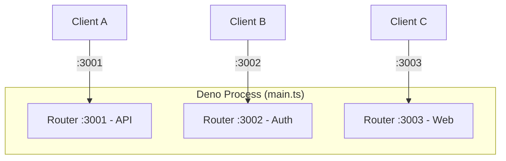
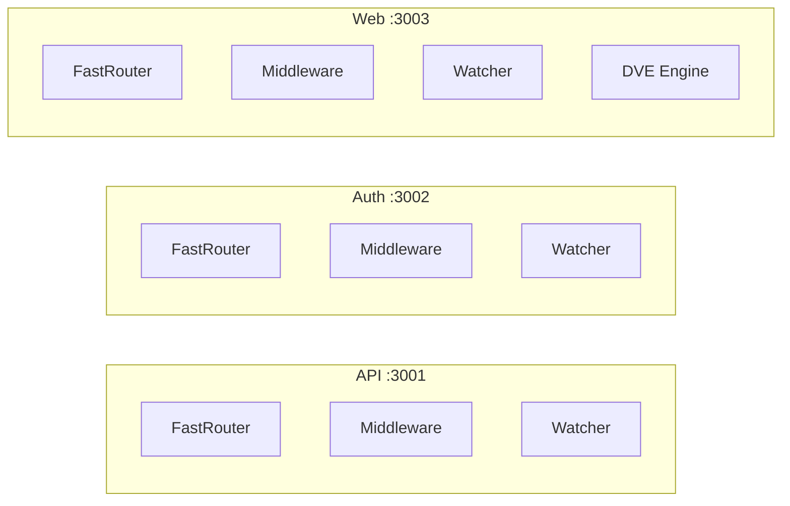
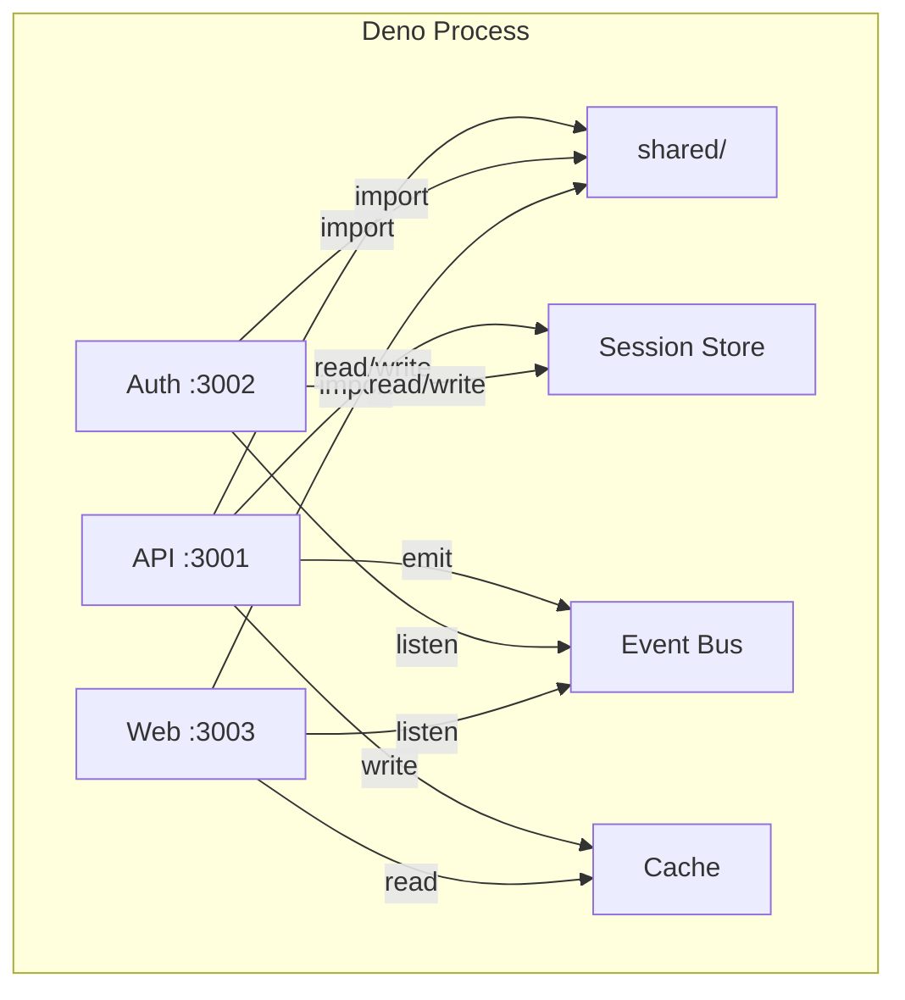
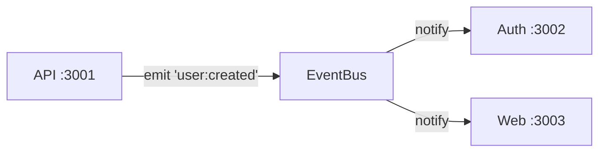
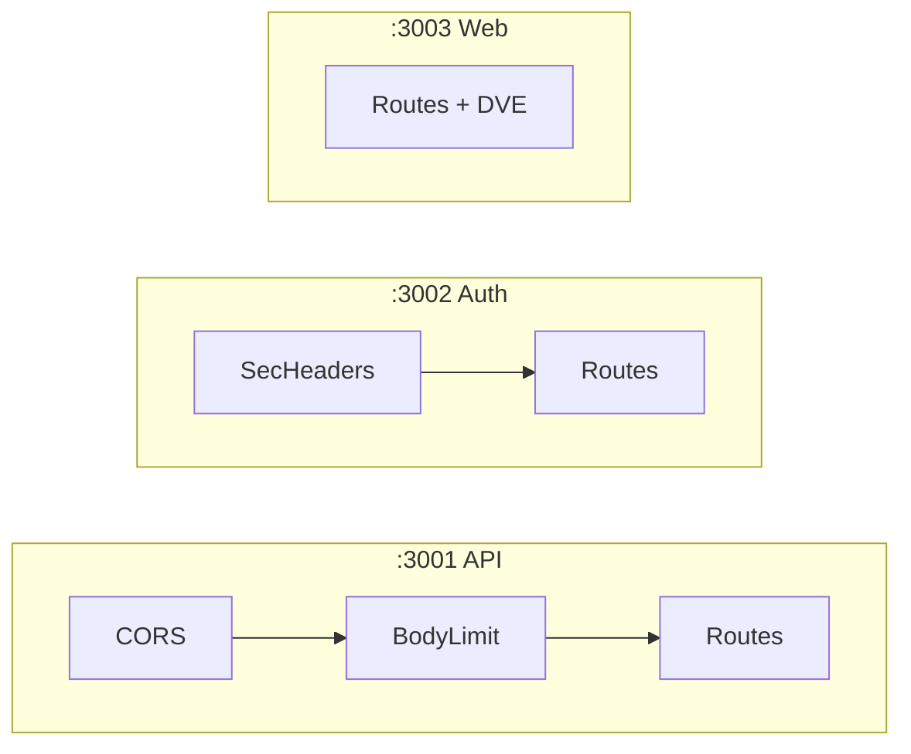
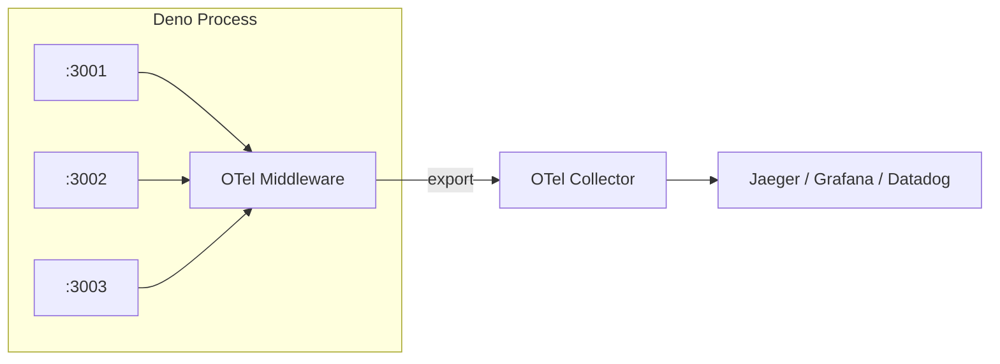
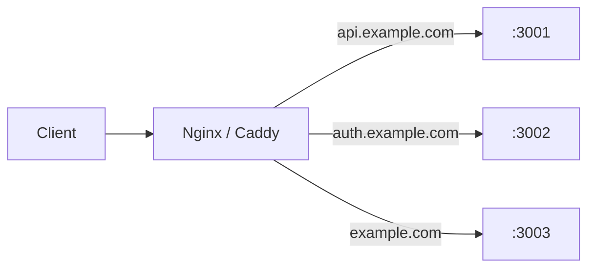
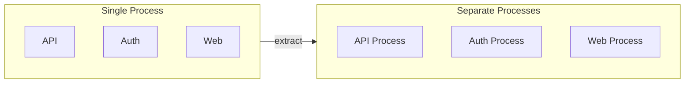

# Multi-Service

> [!WARNING]
> This feature is still under development and has not been officially released.

Deserve lets you run multiple servers from a single Deno process. Each `Router` is a standalone server with its own routes, middleware, file watcher, and port. They are completely isolated from each other, but because they share the same process memory, they can also share code, state, and infrastructure without any network overhead.

Think of it this way: traditionally, running 5 services means 5 processes, 5 deployments, and 5 copies of your shared code. With Deserve, you write one `main.ts` that spawns as many routers as your memory can hold. Each one listens on its own port, watches its own directory, and crashes independently. The rest keep running.



## Basic Setup

One `Router` per service, one port per router, one `Promise.all` to start them all:

```typescript
// 1. Import Router
import { Router } from '@neabyte/deserve'

// 2. Create one Router per service
const api = new Router({ routesDir: './services/api/routes' })
const auth = new Router({ routesDir: './services/auth/routes' })
const web = new Router({
  routesDir: './services/web/routes',
  viewsDir: './services/web/views'
})

// 3. Start all services concurrently
await Promise.all([api.serve(3001), auth.serve(3002), web.serve(3003)])
```

That is the entire entry point.

## Router Isolation

Every `Router` is fully isolated. Each one owns its own radix-tree router, middleware stack, Superwatcher instance, and optional template engine. A thrown error, a syntax mistake, or a crashed handler in one service never bleeds into the others. They do not share any internal state unless you explicitly wire it up.



If a route in API throws an unhandled error, only API returns a 500. Auth and Web continue serving normally.

## Directory Structure

Every service follows the same folder convention. A new team member sees this layout and immediately knows where routes, views, and shared code live. No guessing, no project-specific conventions to learn.

```
project/
├── main.ts
├── shared/
│   ├── utils.ts
│   ├── sessions.ts
│   ├── bus.ts
│   ├── cache.ts
│   ├── logger.ts
│   └── errors.ts
└── services/
    ├── api/
    │   └── routes/
    │       ├── health.ts          # GET  :3001/health
    │       └── users/
    │           ├── index.ts       # GET  :3001/users
    │           └── [id].ts        # GET  :3001/users/:id
    ├── auth/
    │   └── routes/
    │       ├── login.ts           # POST :3002/login
    │       ├── logout.ts          # POST :3002/logout
    │       └── verify.ts          # GET  :3002/verify
    └── web/
        ├── routes/
        │   └── index.ts           # GET  :3003/
        └── views/
            └── home.dve
```

- Routes go in `services/<name>/routes/`
- Shared code goes in `shared/`
- `main.ts` wires everything together

## Sharing Code and State

Routers are isolated, but the process is shared. This is where Deserve's multi-service model shines. Instead of Redis, HTTP calls, or a message broker, your services share state through plain objects in memory - at the speed of a function call.



### Shared Modules

Utility functions, database connections, configuration, validation schemas - write once in `shared/`, import from any service:

```typescript
// shared/utils.ts
// 1. Export shared helpers and constants
export function formatDate(date: Date): string {
  return date.toISOString().split('T')[0]!
}

export const APP_NAME = 'MyApp'
```

```typescript
// services/api/routes/index.ts
// 1. Import shared module directly (same process, no HTTP)
import type { Context } from '@neabyte/deserve'
import { APP_NAME } from '../../../shared/utils.ts'

// 2. Use shared constant in route handler
export function GET(ctx: Context): Response {
  return ctx.send.json({ app: APP_NAME, service: 'api' })
}
```

### Session Store

A single `Map` serves as a session store for all services. Auth writes sessions on login, API reads them to authenticate requests. No Redis, no HTTP call between services:

```typescript
// shared/sessions.ts
// 1. In-memory session store shared by all services
export const sessions = new Map<string, Record<string, unknown>>()
```

```typescript
// services/auth/routes/login.ts
// 1. Import shared session store
import type { Context } from '@neabyte/deserve'
import { sessions } from '../../../shared/sessions.ts'

// 2. Auth writes session on login
export async function POST(ctx: Context): Promise<Response> {
  const body = (await ctx.json()) as { username?: string }
  const id = crypto.randomUUID()
  sessions.set(id, { username: body?.username, loggedInAt: Date.now() })
  return ctx.send.json({ sessionId: id })
}
```

```typescript
// services/api/routes/me.ts
// 1. Import same session store
import type { Context } from '@neabyte/deserve'
import { sessions } from '../../../shared/sessions.ts'

// 2. API reads session directly - no HTTP call to Auth
export function GET(ctx: Context): Response {
  const id = ctx.header('x-session-id') as string | undefined
  const session = id ? sessions.get(id) : undefined
  if (!session) {
    return ctx.send.json({ error: 'Not authenticated' }, 401)
  }
  return ctx.send.json({ user: session })
}
```

### Event Bus

When API creates a user, Auth and Web can know about it instantly. No message queue, no polling - just a direct function call across services:



```typescript
// shared/bus.ts
// 1. Minimal event bus for inter-service communication
type Listener = (...args: unknown[]) => void
const listeners = new Map<string, Set<Listener>>()

export function emit(event: string, ...args: unknown[]): void {
  for (const fn of listeners.get(event) ?? []) fn(...args)
}

export function on(event: string, fn: Listener): void {
  if (!listeners.has(event)) listeners.set(event, new Set())
  listeners.get(event)!.add(fn)
}
```

```typescript
// services/api/routes/users/index.ts
// 1. API emits event when user is created
import type { Context } from '@neabyte/deserve'
import { emit } from '../../../../shared/bus.ts'

export async function POST(ctx: Context): Promise<Response> {
  const user = await ctx.json()
  emit('user:created', user)
  return ctx.send.json({ created: true })
}
```

Any service can listen with `on('user:created', ...)` in `main.ts` or inside its own routes.

### Cache

A shared `Map` with TTL eliminates duplicate work. API computes and caches, Web reads the cached result. Zero network cost:

```typescript
// shared/cache.ts
// 1. Shared in-memory cache with TTL
const store = new Map<string, { value: unknown; expires: number }>()

export function get<T>(key: string): T | undefined {
  const entry = store.get(key)
  if (!entry || entry.expires < Date.now()) {
    store.delete(key)
    return undefined
  }
  return entry.value as T
}

export function set(key: string, value: unknown, ttlMs: number): void {
  store.set(key, { value, expires: Date.now() + ttlMs })
}
```

### HTTP Between Services

When one service needs to call another service's HTTP endpoint (not just shared code), use `fetch`. Both services are in the same process, so the call stays on localhost:

```typescript
// services/web/routes/dashboard.ts
// 1. Fetch from API service, then render with DVE template
import type { Context } from '@neabyte/deserve'

export async function GET(ctx: Context): Promise<Response> {
  const users = await fetch('http://localhost:3001/users').then((r) => r.json())
  return await ctx.render('dashboard.dve', { users })
}
```

## Middleware

Each router has its own middleware stack. You can configure them independently - different middleware per service - or share the same middleware across all of them. This is where the single-process model pays off: write one logger, one error handler, one auth check, and apply them wherever you need.

### Per-Service Configuration

One service can have CORS and body limits, another can have security headers, and a third can run with no middleware at all:



```typescript
// 1. Import Router and Mware
import { Router, Mware } from '@neabyte/deserve'

// 2. API: CORS and body limit
const api = new Router({ routesDir: './services/api/routes' })
api.use(Mware.cors({ origin: '*' }))
api.use(Mware.bodyLimit({ limit: 5 * 1024 * 1024 }))

// 3. Auth: security headers
const auth = new Router({ routesDir: './services/auth/routes' })
auth.use(Mware.securityHeaders({ xFrameOptions: 'DENY' }))

// 4. Web: no middleware needed
const web = new Router({
  routesDir: './services/web/routes',
  viewsDir: './services/web/views'
})

// 5. Start all services
await Promise.all([api.serve(3001), auth.serve(3002), web.serve(3003)])
```

### Shared Logger

Write one logger, apply it to every service. All requests across all ports flow through the same function, tagged by service name. One console, one format, one place to search when something goes wrong:

```typescript
// shared/logger.ts
// 1. Shared logger middleware for all services
import type { Types } from '@neabyte/deserve'

export function logger(service: string): Types.Middleware {
  return async (ctx, next) => {
    const start = Date.now()
    const response = await next()
    const duration = Date.now() - start
    const status = response?.status ?? 0
    console.log(`[${service}] ${ctx.request.method} ${ctx.pathname} ${status} ${duration}ms`)
    return response
  }
}
```

Output from all services in one stream:

```
[API]  GET  /users     200 3ms
[Auth] POST /login     200 12ms
[Web]  GET  /          200 5ms
[API]  GET  /users/99  404 1ms
```

### Shared Error Handler

Write one error handler, apply it with `router.catch()`. Every thrown error, 404, or 500 across all services produces the same error shape. Your team knows exactly what to expect in every error response, regardless of which service returned it:

```typescript
// shared/errors.ts
// 1. Shared error handler for all services
import type { Context, Types } from '@neabyte/deserve'

export function errorHandler(service: string): Types.ErrorMiddleware {
  return (ctx: Context, error: Types.ErrorInfo): Response | null => {
    console.error(
      `[${service}] ${error.method} ${error.pathname} ${error.statusCode} - ${error.error?.message}`
    )
    return ctx.send.json(
      {
        service,
        error: error.error?.message ?? 'Unknown error',
        statusCode: error.statusCode,
        path: error.pathname
      },
      { status: error.statusCode }
    )
  }
}
```

### Wrapping Middleware with Labels

Use `wrapMiddleware` to tag individual middleware with a label. When that middleware throws, the error log includes the label so you know exactly which middleware in which service caused the failure:

```typescript
// main.ts
// 1. Import wrapMiddleware for labeled error catching
import { Router, wrapMiddleware } from '@neabyte/deserve'
import { logger } from './shared/logger.ts'
import { errorHandler } from './shared/errors.ts'

// 2. Wrap middleware with labels per service
const apiAuth = wrapMiddleware('APIAuth', async (ctx, next) => {
  if (!ctx.header('authorization')) {
    throw new Error('Missing API key')
  }
  return await next()
})

const authRateLimit = wrapMiddleware('AuthRateLimit', async (ctx, next) => {
  // rate limit logic
  return await next()
})

const webCache = wrapMiddleware('WebCache', async (ctx, next) => {
  // cache logic
  return await next()
})

// 3. Create services with logger, wrapped middleware, and error handler
const api = new Router({ routesDir: './services/api/routes' })
api.use(logger('API'))
api.use(apiAuth)
api.catch(errorHandler('API'))

const auth = new Router({ routesDir: './services/auth/routes' })
auth.use(logger('Auth'))
auth.use(authRateLimit)
auth.catch(errorHandler('Auth'))

const web = new Router({ routesDir: './services/web/routes', viewsDir: './services/web/views' })
web.use(logger('Web'))
web.use(webCache)
web.catch(errorHandler('Web'))

// 4. Start all services
await Promise.all([api.serve(3001), auth.serve(3002), web.serve(3003)])
```

When `apiAuth` throws, the log reads `[API] GET /users 500 - APIAuth - Missing API key`. When `authRateLimit` throws, it reads `[Auth] POST /login 500 - AuthRateLimit - Too many requests`. Service name, route, and middleware label - all in one line.

### OpenTelemetry

Since every request already flows through shared middleware, plugging in OpenTelemetry is the same pattern. Write one OTel middleware, apply it to every service. All spans from all ports go to one collector. You get distributed tracing, latency dashboards, and error rate metrics across your entire system without instrumenting each service separately:



```typescript
// shared/otel.ts
// 1. Shared OTel middleware for all services
import type { Types } from '@neabyte/deserve'

export function otelMiddleware(service: string): Types.Middleware {
  return async (ctx, next) => {
    const start = performance.now()
    const response = await next()
    const duration = performance.now() - start
    const status = response?.status ?? 0

    // 2. Emit structured span (replace with your OTel SDK)
    console.log(JSON.stringify({
      traceId: crypto.randomUUID(),
      service,
      method: ctx.request.method,
      path: ctx.pathname,
      status,
      durationMs: Math.round(duration * 100) / 100,
      timestamp: new Date().toISOString()
    }))

    return response
  }
}
```

## Hot Reload

Each service has its own file watcher. When you save a file, only the service that owns that directory reloads. The other services keep serving requests without interruption. For full details on how hot reload works, see [Hot Reload](./hot-reload.md).

- **Edit** `services/api/routes/users/index.ts` (only **:3001** reloads the route)
- **Add** `services/auth/routes/reset.ts` (only **:3002** picks up the new route)
- **Edit** `services/web/views/home.dve` (only **:3003** clears template cache)

Your team can work on different services at the same time. One person refactoring API routes, another fixing Auth logic, a third updating Web templates - all without stepping on each other.

## Deployment

### Docker

All services run in one container. One image, one process, all ports:

```dockerfile
FROM denoland/deno:2.5.4

WORKDIR /app
COPY . .

RUN deno cache main.ts

EXPOSE 3001 3002 3003
CMD ["deno", "run", "-A", "main.ts"]
```

### Reverse Proxy

Put Nginx or Caddy in front to route by domain to each service port:



```nginx
# 1. API service
server {
    server_name api.example.com;
    location / { proxy_pass http://127.0.0.1:3001; }
}

# 2. Auth service
server {
    server_name auth.example.com;
    location / { proxy_pass http://127.0.0.1:3002; }
}

# 3. Web service
server {
    server_name example.com;
    location / { proxy_pass http://127.0.0.1:3003; }
}
```

## Scaling Out

When a service outgrows the monolith, extract it into its own process. Copy the folder, add a `main.ts`, deploy independently. The route files do not change - the `Router` API is the same whether you run one service or ten:



- Copy `services/api/` to a new repository
- Add its own `main.ts` with a single `Router`
- Deploy independently

Start with everything in one process. Split when you need to.
