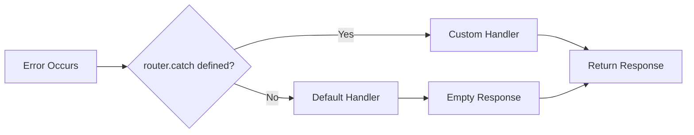

# Default Error Behavior

**TL;DR**: This error handling mechanism catches all errors that occur during server runtime. This includes route handler errors, middleware failures, route not found scenarios, static file errors, and any other uncaught exceptions during request processing. If you don't define a custom error handler with `router.catch()`, Deserve automatically uses this default behavior to ensure your server never crashes from unhandled errors.



## Basic Default Behavior

If you don't call `router.catch()`, Deserve automatically handles all errors with default empty responses and appropriate status codes:

```typescript
import { Router } from '@neabyte/deserve'

const router = new Router({ routesDir: './routes' })

// No router.catch() defined - uses default behavior

await router.serve(8000)
```

## Default Error Response

The default error response provides:
- **Empty Body**: No response body content
- **Status Code**: Preserves the original error status code (404, 500, etc.)
- **Headers**: Includes headers set via `ctx.setHeader()` before the error

```typescript
// Default response structure
// Status: 404 (or other error status code)
// Body: null (empty)
// Headers: Any headers set on context before error
```

## Error Scenarios

Default error handling covers all error types that can occur during request processing:

### 404 - Route Not Found

When a route doesn't exist or no matching route handler is found:

```typescript
// GET /nonexistent
// Status: 404
// Body: null
// Headers: {}
```

This includes:
- Non-existent routes
- Routes with incorrect HTTP methods
- Routes that fail to match during routing resolution

### 500 - Server Errors

When a route handler throws any error or exception:

```typescript
export function GET(ctx: Context): Response {
  throw new Error('Something went wrong')
  // Default response: Status 500, empty body
}
```

This covers:
- Uncaught exceptions in route handlers
- Runtime errors (TypeError, ReferenceError, etc.)
- Async operation failures
- Any error thrown during handler execution

### Middleware Errors

When middleware functions throw errors or fail:

```typescript
router.use(async (ctx, next) => {
  throw new Error('Middleware failed')
  // Default response: Status 500, empty body
})
```

All middleware errors are caught and handled by the default error handler.

### Static File Errors

When serving static files encounters issues:

```typescript
router.static('/static', { path: './public' })

// GET /static/missing.jpg
// Status: 404 (file not found)
// Body: null
// Headers: {}
```

This includes:
- File not found errors (404)
- File read permission errors (500)
- Filesystem operation failures (500)
- Invalid path resolution errors (500)

### Request Processing Errors

Any unexpected errors during request handling:

```typescript
// Errors in:
// - URL parsing
// - Context creation
// - Route matching
// - Response generation
// All default to: Status 500, empty body
```

### Error Handling Guarantees

The default error handler ensures:
- **No server crashes**: All errors are caught and converted to HTTP responses
- **Consistent behavior**: Same error response format across all error types
- **Header preservation**: Headers set before the error are retained in the response
- **Status code accuracy**: Original error status codes (404, 500, etc.) are preserved
