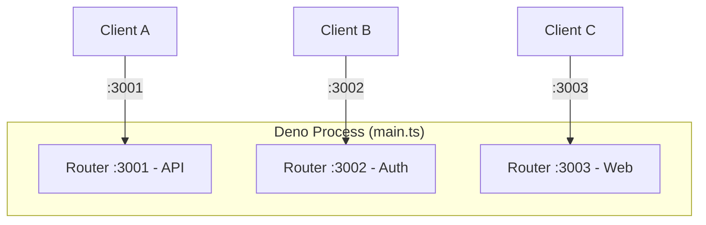
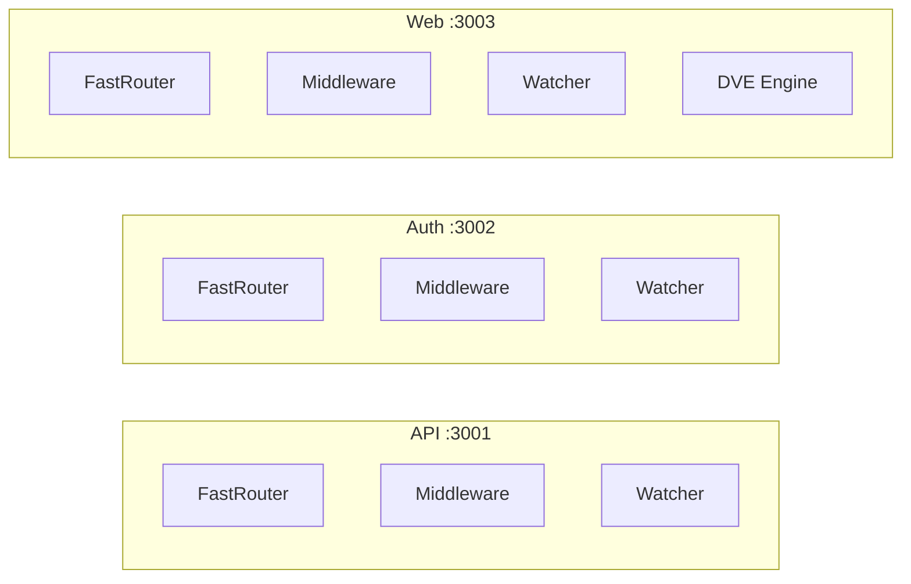
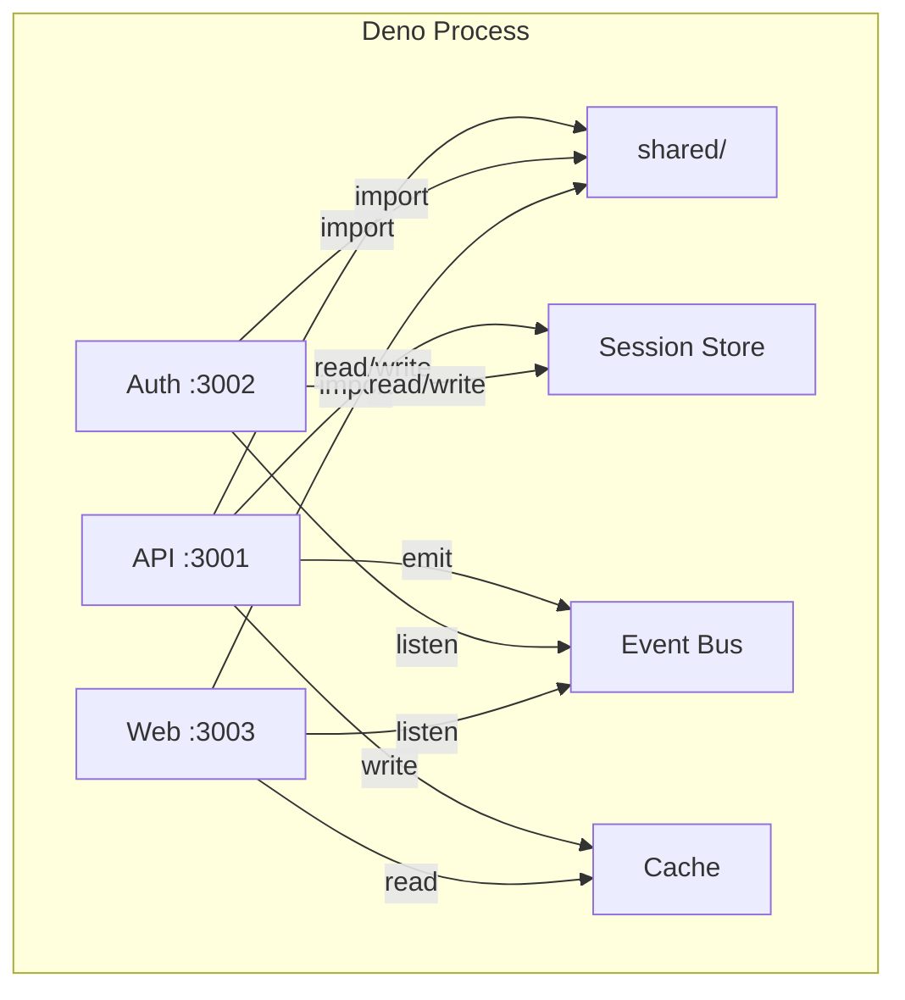
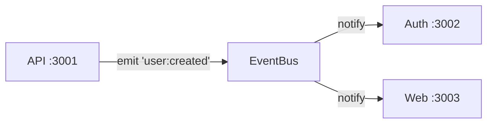
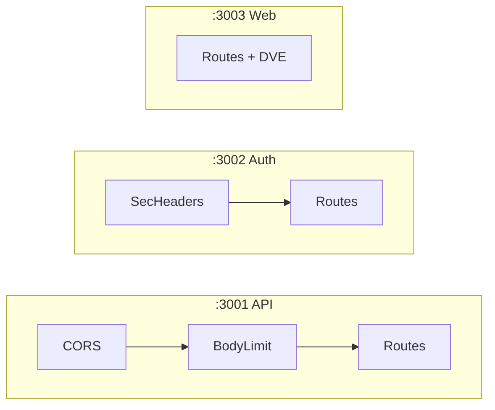
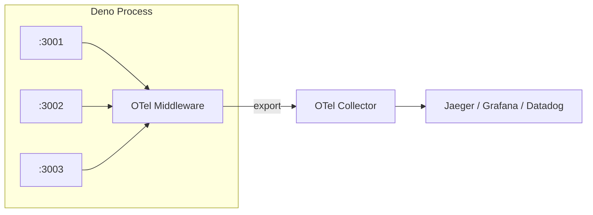
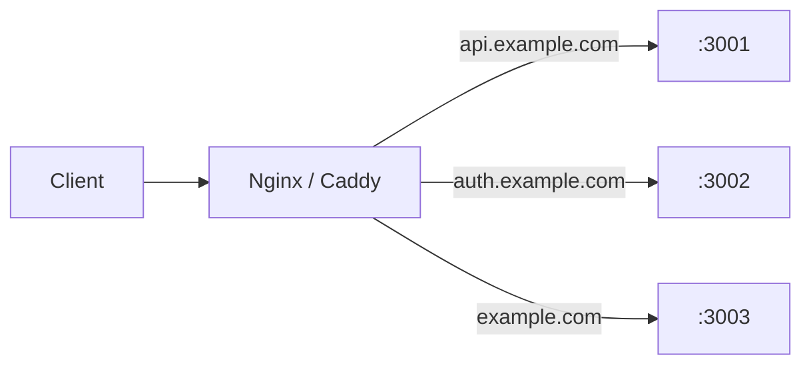
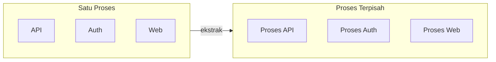

# Multi-Service

> [!WARNING]
> Fitur ini masih dalam tahap pengembangan dan belum dirilis secara resmi.

Deserve memungkinkan Anda menjalankan beberapa server dari satu proses Deno. Setiap `Router` adalah server mandiri dengan rute, middleware, file watcher, dan port miliknya sendiri. Masing-masing terisolasi sepenuhnya, tapi karena berbagi memori proses yang sama, mereka juga bisa berbagi kode, state, dan infrastruktur tanpa overhead jaringan apapun.

Bayangkan seperti ini: secara tradisional, menjalankan 5 service berarti 5 proses, 5 deployment, dan 5 salinan kode yang sama. Dengan Deserve, Anda cukup menulis satu `main.ts` yang menjalankan sebanyak mungkin router sesuai kapasitas memori. Masing-masing listen di port sendiri, memantau direktori sendiri, dan crash secara independen. Yang lain tetap berjalan.



## Setup Dasar

Satu `Router` per service, satu port per router, satu `Promise.all` untuk menjalankan semuanya:

```typescript
// 1. Import Router
import { Router } from '@neabyte/deserve'

// 2. Buat satu Router per service
const api = new Router({ routesDir: './services/api/routes' })
const auth = new Router({ routesDir: './services/auth/routes' })
const web = new Router({
  routesDir: './services/web/routes',
  viewsDir: './services/web/views'
})

// 3. Jalankan semua service secara bersamaan
await Promise.all([api.serve(3001), auth.serve(3002), web.serve(3003)])
```

Itu saja entry point-nya.

## Isolasi Router

Setiap `Router` terisolasi sepenuhnya. Masing-masing memiliki radix-tree router, middleware stack, Superwatcher, dan opsional template engine sendiri. Error yang dilempar, kesalahan syntax, atau handler yang crash di satu service tidak pernah merembet ke yang lain. Mereka tidak berbagi state internal kecuali Anda secara eksplisit menghubungkannya.



Jika sebuah rute di API melempar error yang tidak tertangani, hanya API yang mengembalikan 500. Auth dan Web tetap melayani request seperti biasa.

## Struktur Direktori

Setiap service mengikuti konvensi folder yang sama. Anggota tim baru melihat layout ini dan langsung tahu di mana letak rute, view, dan kode bersama. Tidak perlu menebak, tidak perlu mempelajari konvensi khusus proyek.

```
project/
├── main.ts
├── shared/
│   ├── utils.ts
│   ├── sessions.ts
│   ├── bus.ts
│   ├── cache.ts
│   ├── logger.ts
│   └── errors.ts
└── services/
    ├── api/
    │   └── routes/
    │       ├── health.ts          # GET  :3001/health
    │       └── users/
    │           ├── index.ts       # GET  :3001/users
    │           └── [id].ts        # GET  :3001/users/:id
    ├── auth/
    │   └── routes/
    │       ├── login.ts           # POST :3002/login
    │       ├── logout.ts          # POST :3002/logout
    │       └── verify.ts          # GET  :3002/verify
    └── web/
        ├── routes/
        │   └── index.ts           # GET  :3003/
        └── views/
            └── home.dve
```

- Rute disimpan di `services/<nama>/routes/`
- Kode bersama disimpan di `shared/`
- `main.ts` menghubungkan semuanya

## Berbagi Kode dan State

Router terisolasi, tapi prosesnya berbagi. Di sinilah model multi-service Deserve bersinar. Daripada Redis, HTTP call, atau message broker, service Anda berbagi state melalui objek biasa di memori - secepat pemanggilan fungsi.



### Modul Bersama

Fungsi utilitas, koneksi database, konfigurasi, skema validasi - tulis sekali di `shared/`, impor dari service manapun:

```typescript
// shared/utils.ts
// 1. Ekspor helper dan konstanta bersama
export function formatDate(date: Date): string {
  return date.toISOString().split('T')[0]!
}

export const APP_NAME = 'MyApp'
```

```typescript
// services/api/routes/index.ts
// 1. Impor modul bersama langsung (proses yang sama, tanpa HTTP)
import type { Context } from '@neabyte/deserve'
import { APP_NAME } from '../../../shared/utils.ts'

// 2. Gunakan konstanta bersama di route handler
export function GET(ctx: Context): Response {
  return ctx.send.json({ app: APP_NAME, service: 'api' })
}
```

### Session Store

Satu `Map` berfungsi sebagai session store untuk semua service. Auth menulis session saat login, API membacanya untuk autentikasi request. Tanpa Redis, tanpa HTTP call antar service:

```typescript
// shared/sessions.ts
// 1. Session store in-memory yang dibagikan ke semua service
export const sessions = new Map<string, Record<string, unknown>>()
```

```typescript
// services/auth/routes/login.ts
// 1. Impor session store bersama
import type { Context } from '@neabyte/deserve'
import { sessions } from '../../../shared/sessions.ts'

// 2. Auth menulis session saat login
export async function POST(ctx: Context): Promise<Response> {
  const body = (await ctx.json()) as { username?: string }
  const id = crypto.randomUUID()
  sessions.set(id, { username: body?.username, loggedInAt: Date.now() })
  return ctx.send.json({ sessionId: id })
}
```

```typescript
// services/api/routes/me.ts
// 1. Impor session store yang sama
import type { Context } from '@neabyte/deserve'
import { sessions } from '../../../shared/sessions.ts'

// 2. API membaca session langsung - tanpa HTTP call ke Auth
export function GET(ctx: Context): Response {
  const id = ctx.header('x-session-id') as string | undefined
  const session = id ? sessions.get(id) : undefined
  if (!session) {
    return ctx.send.json({ error: 'Not authenticated' }, 401)
  }
  return ctx.send.json({ user: session })
}
```

### Event Bus

Ketika API membuat user, Auth dan Web bisa mengetahuinya secara instan. Tanpa message queue, tanpa polling - cukup pemanggilan fungsi langsung antar service:



```typescript
// shared/bus.ts
// 1. Event bus minimal untuk komunikasi antar service
type Listener = (...args: unknown[]) => void
const listeners = new Map<string, Set<Listener>>()

export function emit(event: string, ...args: unknown[]): void {
  for (const fn of listeners.get(event) ?? []) fn(...args)
}

export function on(event: string, fn: Listener): void {
  if (!listeners.has(event)) listeners.set(event, new Set())
  listeners.get(event)!.add(fn)
}
```

```typescript
// services/api/routes/users/index.ts
// 1. API emit event ketika user dibuat
import type { Context } from '@neabyte/deserve'
import { emit } from '../../../../shared/bus.ts'

export async function POST(ctx: Context): Promise<Response> {
  const user = await ctx.json()
  emit('user:created', user)
  return ctx.send.json({ created: true })
}
```

Service manapun bisa listen dengan `on('user:created', ...)` di `main.ts` atau di dalam rute masing-masing.

### Cache

`Map` bersama dengan TTL menghilangkan pekerjaan duplikat. API menghitung dan menyimpan cache, Web membaca hasilnya. Tanpa biaya jaringan:

```typescript
// shared/cache.ts
// 1. Cache in-memory bersama dengan TTL
const store = new Map<string, { value: unknown; expires: number }>()

export function get<T>(key: string): T | undefined {
  const entry = store.get(key)
  if (!entry || entry.expires < Date.now()) {
    store.delete(key)
    return undefined
  }
  return entry.value as T
}

export function set(key: string, value: unknown, ttlMs: number): void {
  store.set(key, { value, expires: Date.now() + ttlMs })
}
```

### HTTP Antar Service

Ketika satu service perlu memanggil endpoint HTTP service lain (bukan hanya kode bersama), gunakan `fetch`. Kedua service berada di proses yang sama, jadi panggilan tetap di localhost:

```typescript
// services/web/routes/dashboard.ts
// 1. Fetch dari service API, lalu render dengan template DVE
import type { Context } from '@neabyte/deserve'

export async function GET(ctx: Context): Promise<Response> {
  const users = await fetch('http://localhost:3001/users').then((r) => r.json())
  return await ctx.render('dashboard.dve', { users })
}
```

## Middleware

Setiap router memiliki middleware stack sendiri. Anda bisa mengkonfigurasi mereka secara independen - middleware berbeda per service - atau berbagi middleware yang sama di semua service. Di sinilah model single-process terbayar: tulis satu logger, satu error handler, satu auth check, dan terapkan di mana pun Anda butuhkan.

### Konfigurasi Per Service

Satu service bisa memiliki CORS dan body limit, yang lain bisa memiliki security headers, dan yang ketiga bisa berjalan tanpa middleware sama sekali:



```typescript
// 1. Import Router dan Mware
import { Router, Mware } from '@neabyte/deserve'

// 2. API: CORS dan body limit
const api = new Router({ routesDir: './services/api/routes' })
api.use(Mware.cors({ origin: '*' }))
api.use(Mware.bodyLimit({ limit: 5 * 1024 * 1024 }))

// 3. Auth: security headers
const auth = new Router({ routesDir: './services/auth/routes' })
auth.use(Mware.securityHeaders({ xFrameOptions: 'DENY' }))

// 4. Web: tidak perlu middleware
const web = new Router({
  routesDir: './services/web/routes',
  viewsDir: './services/web/views'
})

// 5. Jalankan semua service
await Promise.all([api.serve(3001), auth.serve(3002), web.serve(3003)])
```

### Logger Bersama

Tulis satu logger, terapkan ke setiap service. Semua request dari semua port melewati fungsi yang sama, ditandai dengan nama service. Satu console, satu format, satu tempat untuk mencari ketika ada masalah:

```typescript
// shared/logger.ts
// 1. Middleware logger bersama untuk semua service
import type { Types } from '@neabyte/deserve'

export function logger(service: string): Types.Middleware {
  return async (ctx, next) => {
    const start = Date.now()
    const response = await next()
    const duration = Date.now() - start
    const status = response?.status ?? 0
    console.log(`[${service}] ${ctx.request.method} ${ctx.pathname} ${status} ${duration}ms`)
    return response
  }
}
```

Output dari semua service dalam satu stream:

```
[API]  GET  /users     200 3ms
[Auth] POST /login     200 12ms
[Web]  GET  /          200 5ms
[API]  GET  /users/99  404 1ms
```

### Error Handler Bersama

Tulis satu error handler, terapkan dengan `router.catch()`. Setiap error yang dilempar, 404, atau 500 di semua service menghasilkan bentuk error yang sama. Tim Anda tahu persis apa yang diharapkan di setiap error response, tanpa peduli service mana yang mengembalikannya:

```typescript
// shared/errors.ts
// 1. Error handler bersama untuk semua service
import type { Context, Types } from '@neabyte/deserve'

export function errorHandler(service: string): Types.ErrorMiddleware {
  return (ctx: Context, error: Types.ErrorInfo): Response | null => {
    console.error(
      `[${service}] ${error.method} ${error.pathname} ${error.statusCode} - ${error.error?.message}`
    )
    return ctx.send.json(
      {
        service,
        error: error.error?.message ?? 'Unknown error',
        statusCode: error.statusCode,
        path: error.pathname
      },
      { status: error.statusCode }
    )
  }
}
```

### Membungkus Middleware dengan Label

Gunakan `wrapMiddleware` untuk menandai middleware individual dengan label. Ketika middleware tersebut melempar error, log error menyertakan label sehingga Anda tahu persis middleware mana di service mana yang menyebabkan kegagalan:

```typescript
// main.ts
// 1. Import wrapMiddleware untuk penangkapan error berlabel
import { Router, wrapMiddleware } from '@neabyte/deserve'
import { logger } from './shared/logger.ts'
import { errorHandler } from './shared/errors.ts'

// 2. Bungkus middleware dengan label per service
const apiAuth = wrapMiddleware('APIAuth', async (ctx, next) => {
  if (!ctx.header('authorization')) {
    throw new Error('Missing API key')
  }
  return await next()
})

const authRateLimit = wrapMiddleware('AuthRateLimit', async (ctx, next) => {
  // logika rate limit
  return await next()
})

const webCache = wrapMiddleware('WebCache', async (ctx, next) => {
  // logika cache
  return await next()
})

// 3. Buat service dengan logger, middleware terbungkus, dan error handler
const api = new Router({ routesDir: './services/api/routes' })
api.use(logger('API'))
api.use(apiAuth)
api.catch(errorHandler('API'))

const auth = new Router({ routesDir: './services/auth/routes' })
auth.use(logger('Auth'))
auth.use(authRateLimit)
auth.catch(errorHandler('Auth'))

const web = new Router({ routesDir: './services/web/routes', viewsDir: './services/web/views' })
web.use(logger('Web'))
web.use(webCache)
web.catch(errorHandler('Web'))

// 4. Jalankan semua service
await Promise.all([api.serve(3001), auth.serve(3002), web.serve(3003)])
```

Ketika `apiAuth` melempar error, log-nya terbaca `[API] GET /users 500 - APIAuth - Missing API key`. Ketika `authRateLimit` melempar, terbaca `[Auth] POST /login 500 - AuthRateLimit - Too many requests`. Nama service, rute, dan label middleware - semua dalam satu baris.

### OpenTelemetry

Karena setiap request sudah melewati middleware bersama, memasang OpenTelemetry mengikuti pola yang sama. Tulis satu middleware OTel, terapkan ke setiap service. Semua span dari semua port menuju satu collector. Anda mendapatkan distributed tracing, dashboard latensi, dan metrik error rate di seluruh sistem tanpa harus menginstrumentasi setiap service secara terpisah:



```typescript
// shared/otel.ts
// 1. Middleware OTel bersama untuk semua service
import type { Types } from '@neabyte/deserve'

export function otelMiddleware(service: string): Types.Middleware {
  return async (ctx, next) => {
    const start = performance.now()
    const response = await next()
    const duration = performance.now() - start
    const status = response?.status ?? 0

    // 2. Kirim span terstruktur (ganti dengan OTel SDK Anda)
    console.log(JSON.stringify({
      traceId: crypto.randomUUID(),
      service,
      method: ctx.request.method,
      path: ctx.pathname,
      status,
      durationMs: Math.round(duration * 100) / 100,
      timestamp: new Date().toISOString()
    }))

    return response
  }
}
```

## Hot Reload

Setiap service memiliki file watcher sendiri. Ketika Anda menyimpan file, hanya service yang memiliki direktori tersebut yang reload. Service lain tetap melayani request tanpa gangguan. Untuk detail lengkap cara kerja hot reload, lihat [Hot Reload](./hot-reload.md).

- **Edit** `services/api/routes/users/index.ts` (hanya **:3001** yang reload rute)
- **Tambah** `services/auth/routes/reset.ts` (hanya **:3002** yang mendeteksi rute baru)
- **Edit** `services/web/views/home.dve` (hanya **:3003** yang membersihkan cache template)

Tim Anda bisa bekerja di service yang berbeda secara bersamaan. Satu orang merefaktor rute API, yang lain memperbaiki logika Auth, yang ketiga memperbarui template Web - semua tanpa saling mengganggu.

## Deployment

### Docker

Semua service berjalan di satu container. Satu image, satu proses, semua port:

```dockerfile
FROM denoland/deno:2.5.4

WORKDIR /app
COPY . .

RUN deno cache main.ts

EXPOSE 3001 3002 3003
CMD ["deno", "run", "-A", "main.ts"]
```

### Reverse Proxy

Letakkan Nginx atau Caddy di depan untuk mengarahkan domain ke setiap port service:



```nginx
# 1. Service API
server {
    server_name api.example.com;
    location / { proxy_pass http://127.0.0.1:3001; }
}

# 2. Service Auth
server {
    server_name auth.example.com;
    location / { proxy_pass http://127.0.0.1:3002; }
}

# 3. Service Web
server {
    server_name example.com;
    location / { proxy_pass http://127.0.0.1:3003; }
}
```

## Scaling Out

Ketika sebuah service tumbuh melampaui monolit, ekstrak ke proses terpisah. Salin foldernya, tambahkan `main.ts`, deploy secara independen. File rute tidak berubah - API `Router` sama baik Anda menjalankan satu service maupun sepuluh:



- Salin `services/api/` ke repositori baru
- Tambahkan `main.ts` sendiri dengan satu `Router`
- Deploy secara independen

Mulai dengan semuanya dalam satu proses. Pisahkan ketika diperlukan.
