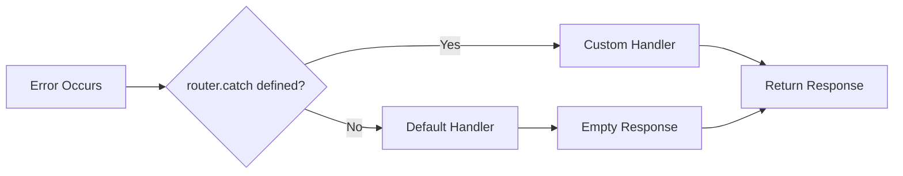

# Perilaku Default Error

**TL;DR**: Mekanisme penanganan error ini menangkap semua error yang terjadi selama runtime server. Ini termasuk route handler errors, middleware failures, route not found scenarios, static file errors, dan uncaught exceptions lainnya selama pemrosesan request. Jika Anda tidak mendefinisikan custom error handler dengan `router.catch()`, Deserve secara otomatis menggunakan perilaku default ini untuk memastikan server Anda tidak pernah crash dari unhandled errors.



## Perilaku Default Dasar

Jika Anda tidak memanggil `router.catch()`, Deserve secara otomatis menangani semua error dengan empty responses default dan status code yang sesuai:

```typescript
import { Router } from '@neabyte/deserve'

const router = new Router({ routesDir: './routes' })

// Tidak ada router.catch() yang didefinisikan - menggunakan perilaku default

await router.serve(8000)
```

## Response Error Default

Response error default menyediakan:
- **Empty Body**: Tidak ada konten response body
- **Status Code**: Mempertahankan status code error original (404, 500, dll.)
- **Headers**: Menyertakan headers yang diatur via `ctx.setHeader()` sebelum error

```typescript
// Struktur response default
// Status: 404 (atau status code error lainnya)
// Body: null (kosong)
// Headers: Header apa pun yang diatur di context sebelum error
```

## Skenario Error

Penanganan error default mencakup semua tipe error yang dapat terjadi selama pemrosesan request:

### 404 - Route Tidak Ditemukan

Ketika route tidak ada atau tidak ada route handler yang cocok ditemukan:

```typescript
// GET /nonexistent
// Status: 404
// Body: null
// Headers: {}
```

Ini termasuk:
- Routes yang tidak ada
- Routes dengan HTTP methods yang salah
- Routes yang gagal match selama routing resolution

### 500 - Server Errors

Ketika route handler melempar error atau exception:

```typescript
export function GET(ctx: Context): Response {
  throw new Error('Something went wrong')
  // Response default: Status 500, empty body
}
```

Ini mencakup:
- Uncaught exceptions di route handlers
- Runtime errors (TypeError, ReferenceError, dll.)
- Async operation failures
- Error apa pun yang dilempar selama eksekusi handler

### Middleware Errors

Ketika fungsi middleware melempar error atau gagal:

```typescript
router.use(async (ctx, next) => {
  throw new Error('Middleware failed')
  // Response default: Status 500, empty body
})
```

Semua middleware errors ditangkap dan ditangani oleh default error handler.

### Static File Errors

Ketika menyajikan file statis menemui masalah:

```typescript
router.static('/static', { path: './public' })

// GET /static/missing.jpg
// Status: 404 (file tidak ditemukan)
// Body: null
// Headers: {}
```

Ini termasuk:
- File not found errors (404)
- File read permission errors (500)
- Filesystem operation failures (500)
- Invalid path resolution errors (500)

### Request Processing Errors

Error tak terduga selama penanganan request:

```typescript
// Errors di:
// - URL parsing
// - Context creation
// - Route matching
// - Response generation
// Semua default ke: Status 500, empty body
```

### Jaminan Penanganan Error

Default error handler memastikan:
- **Tidak ada crash server**: Semua error ditangkap dan dikonversi ke HTTP responses
- **Perilaku konsisten**: Format response error yang sama di semua tipe error
- **Preservasi header**: Header yang diatur sebelum error dipertahankan di response
- **Akurasi status code**: Status code error original (404, 500, dll.) dipertahankan

