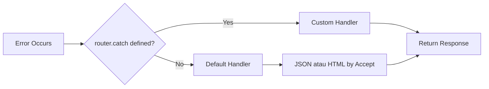

# Perilaku Default Error

**TL;DR**: Mekanisme penanganan error ini menangkap semua error yang terjadi selama runtime server. Ini termasuk route handler errors, middleware failures, route not found scenarios, static file errors, dan uncaught exceptions lainnya selama pemrosesan request. Jika Anda tidak mendefinisikan custom error handler dengan `router.catch()`, Deserve secara otomatis menggunakan perilaku default ini untuk memastikan server Anda tidak pernah crash dari unhandled errors.


```mermaid
flowchart LR
    A[Error Occurs] --> B{router.catch defined?}
    B -->|No| C[Default Handler]
    B -->|Yes| D[Custom Handler]
    C --> E[JSON atau HTML by Accept]
    D --> F
    E --> F[Return Response]
```

## Perilaku Default Dasar

Jika Anda tidak memanggil `router.catch()`, Deserve secara otomatis menangani semua error dengan response default (JSON atau HTML) dan status code yang sesuai:

```typescript
// 1. Import Router
import { Router } from '@neabyte/deserve'

// 2. Buat router
const router = new Router({ routesDir: './routes' })

// 3. Tidak panggil router.catch() — error akan pakai response default (JSON/HTML by Accept)

// 4. Jalankan server
await router.serve(8000)
```

## Response Error Default

Response error default (tanpa custom `router.catch()`) mengikuti header `Accept` client:

- **Accept menyertakan `application/json`** → Body JSON: `{ error, path, statusCode }`
- **Selain itu** → Body HTML: halaman error sederhana dengan status dan pesan (escaped)

Selain itu:

- **Status Code**: Mempertahankan status code error original (404, 500, dll.)
- **Headers**: Menyertakan headers yang diatur via `ctx.setHeader()` sebelum error

```typescript
// Contoh response default (client minta JSON)
// Status: 404
// Body: { "error": "...", "path": "/api/foo", "statusCode": 404 }

// Contoh response default (client tidak minta JSON)
// Status: 404
// Body: HTML dengan <title>404</title> dan pesan error
```

## Skenario Error

Penanganan error default mencakup semua tipe error yang dapat terjadi selama pemrosesan request:

### 404 — Route Tidak Ditemukan

Ketika route tidak ada atau tidak ada route handler yang cocok ditemukan:

```typescript
// GET /nonexistent
// Status: 404
// Body: JSON atau HTML (sesuai Accept)
// Headers: {}
```

Ini termasuk:

- Routes yang tidak ada
- Routes dengan HTTP methods yang salah
- Routes yang gagal match selama routing resolution

### 500 — Server Errors

Ketika route handler melempar error atau exception:

```typescript
export function GET(ctx: Context): Response {
  // 1. Melempar error → ditangkap oleh Deserve
  throw new Error('Something went wrong')
  // 2. Response default: Status 500, body JSON/HTML (tanpa router.catch)
}
```

Ini mencakup:

- Uncaught exceptions di route handlers
- Runtime errors (TypeError, ReferenceError, dll.)
- Async operation failures
- Error apa pun yang dilempar selama eksekusi handler

### Error Middleware

Ketika fungsi middleware melempar error atau gagal:

```typescript
// 1. Middleware melempar → error ditangkap
router.use(async (ctx, next) => {
  throw new Error('Middleware failed')
  // 2. Response default: Status 500, body JSON/HTML
})
```

Semua middleware errors ditangkap dan ditangani oleh default error handler.

### Error File Statis

Ketika menyajikan file statis menemui masalah:

```typescript
// 1. Mount static files di /static
router.static('/static', { path: './public' })

// 2. Jika file tidak ada (GET /static/missing.jpg):
//    Status: 404, Body: JSON/HTML sesuai Accept
```

Ini termasuk:

- File not found errors (404)
- File read permission errors (500)
- Filesystem operation failures (500)
- Invalid path resolution errors (500)

### Error Saat Memproses Request

Error tak terduga selama penanganan request:

```typescript
// Errors di:
// - URL parsing
// - Context creation
// - Route matching
// - Response generation
// Semua default ke: Status 500, body JSON/HTML
```

### Jaminan Penanganan Error

Default error handler memastikan:

- **Tidak ada crash server**: Semua error ditangkap dan dikonversi ke HTTP responses
- **Perilaku konsisten**: Format response error yang sama di semua tipe error
- **Preservasi header**: Header yang diatur sebelum error dipertahankan di response
- **Akurasi status code**: Status code error original (404, 500, dll.) dipertahankan
