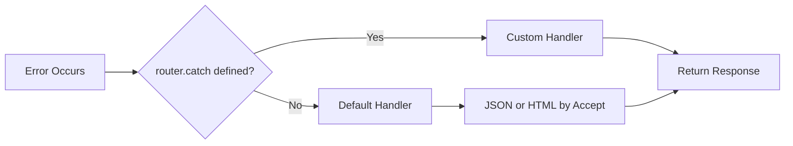

# Perilaku Error Default

Mekanisme penanganan error ini menangkap setiap error yang terjadi selama runtime server, yang mencakup error route handler, kegagalan middleware, skenario rute tidak ditemukan, error berkas statis, dan exception tak tertangkap lainnya selama pemrosesan request. Tanpa error handler khusus yang diatur lewat `router.catch()`, Deserve jatuh ke perilaku default ini supaya server tidak pernah crash karena error tak tertangani.


```mermaid
flowchart LR
    A[Error Occurs] --> B{router.catch defined?}
    B -->|No| C[Default Handler]
    B -->|Yes| D[Custom Handler]
    C --> E[JSON or HTML by Accept]
    D --> F
    E --> F[Return Response]
```

## Perilaku Default Dasar

Tanpa panggilan ke `router.catch()`, Deserve menangani setiap error dengan response default, JSON atau HTML, dan status code yang cocok:

```typescript twoslash
import { Router } from '@neabyte/deserve'

const router = new Router({ routesDir: './routes' })

// Tanpa router.catch, default mengambil alih

await router.serve(8000)
```

## Response Error Default

Response error default (tanpa `router.catch()` khusus) mengikuti header `Accept` klien:

- **Accept mencakup `application/json`** → body JSON: `{ error, path, statusCode }`
- **Selain itu** → body HTML: halaman error sederhana dengan status dan pesan (di-escape)

Juga:

- **Status Code**: Mempertahankan status code error asli (404, 500, dll.)
- **Header**: Mencakup header yang diatur lewat `ctx.setHeader()` sebelum error

```typescript
// Contoh response default (klien minta JSON)
// Status: 404
// Body: { "error": "...", "path": "/api/foo", "statusCode": 404 }

// Contoh response default (klien tidak minta JSON)
// Status: 404
// Body: HTML dengan <title>404</title> dan pesan error
```

## Skenario Error

Penanganan error default menutup semua jenis error yang bisa terjadi selama pemrosesan request:

### 404 - Rute Tidak Ditemukan

Ketika rute tidak ada atau tidak ada route handler yang cocok:

```typescript
// GET /nonexistent
// Status: 404
// Body: JSON atau HTML (lewat header Accept)
// Headers: {}
```

Ini mencakup:

- Rute yang tidak ada
- Rute dengan metode HTTP yang salah
- Rute yang gagal cocok saat resolusi routing

### 500 - Error Server

Ketika route handler melempar error atau exception apa pun:

```typescript twoslash
import type { Context } from '@neabyte/deserve'
// ---cut---
export function GET(ctx: Context): Response {
  // Lemparan ditangkap oleh Deserve
  throw new Error('Something went wrong')
  // Balasan default adalah 500 JSON atau HTML
}
```

Ini mencakup:

- Exception tak tertangkap di route handler
- Error runtime (TypeError, ReferenceError, dll.)
- Kegagalan operasi async
- Error apa pun yang dilempar selama eksekusi handler

### Error Middleware

Ketika fungsi middleware melempar error atau gagal:

```typescript twoslash
import { Router } from '@neabyte/deserve'

const router = new Router()
// ---cut---
// Middleware yang melempar juga ditangkap
router.use(async (ctx, next) => {
  throw new Error('Middleware failed')
  // Balasan default adalah 500 JSON atau HTML
})
```

Semua error middleware ditangkap dan ditangani oleh error handler default.

### Error Berkas Statis

Ketika melayani berkas statis menemui masalah:

```typescript twoslash
import { Router } from '@neabyte/deserve'

const router = new Router()
// ---cut---
// Layani berkas statis di /static
router.static('/static', { path: './public' })

// Berkas hilang (GET /static/missing.jpg):
//   Status 404, JSON atau HTML per Accept
```

Ini mencakup:

- Error berkas tidak ditemukan (404)
- Error izin baca berkas (500)
- Kegagalan operasi filesystem (500)
- Error resolusi path tidak valid (500)

### Error Pemrosesan Request

Error tak terduga apa pun selama penanganan request:

```typescript
// Error di:
// - Parsing URL
// - Pembuatan Context
// - Pencocokan rute
// - Pembuatan response
// Semua default ke: Status 500, body JSON atau HTML (lewat Accept)
```

### Jaminan Penanganan Error

Error handler default memastikan:

- **Tanpa crash server**: Semua error ditangkap dan diubah jadi response HTTP
- **Perilaku konsisten**: Format response error sama di semua jenis error
- **Pelestarian header**: Header yang diatur sebelum error dipertahankan di response
- **Akurasi status code**: Status code error asli (404, 500, dll.) dipertahankan
